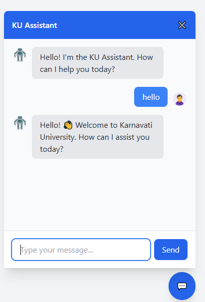

# 🧠 Karnavati University Chatbot Assistant

Welcome to the  **Karnavati University Assistant Chatbot** — a dynamic, web-based support tool designed to help students, parents, and visitors quickly access essential information about the university, including admissions, courses, fees, campus life, and more.

---

GROUP MEMBERS :-

- Panchal Roshan      [ID :- KU2407U365] <br>
- Bhavyakumar Patel   [ID :- KU2407U266] <br>
- Aksh Patel          [ID :- KU2407U250] <br>
- Neer Patel          [ID :- KU2407U347] <br>
- Neel Sewani         [ID :- KU2407U338] <br>

---

## 📌 Project Overview

This is a simple web-based chatbot built using Python and Flask. It provides quick and informative responses about Karnavati University to prospective students, parents, and visitors.

Key features include:

- Fast and responsive UI using TailwindCSS
- Asynchronous communication with the backend using JavaScript `fetch`
- Organized response system for keyword-based FAQs
- Fully contained and easily deployable as a microservice or embedded widget

---

## 🗂️ File Structure

```
📦 KU Chatbot
 ┣ 📄 app.py              → Flask backend for serving responses
 ┣ 📄 index.html          → Frontend interface containing chat UI
 ┣ 📄 script.js           → (Optional) Vanilla JS handler for message animation
 ┣ 📄 styles.css          → Additional styling for chat window
```

### 🔹 `app.py`

- Core Flask application
- Serves `index.html` at the root (`/`)
- Handles POST requests to `/get` and responds with appropriate message
- Uses a dictionary (`responses`) to match input keywords and return HTML-friendly replies
- Includes links for admissions, hostel, fees, scholarships, and more

### 🔹 `index.html`

- Contains the full HTML for a floating chatbot interface
- Uses **Tailwind CSS** via CDN for styling
- Fixed chat window with toggling open/close behavior
- Integrates live interaction via `fetch` to the backend endpoint

### 🔹 `script.js` (optional feature)

- Adds typing animation for bot messages
- Adds enhanced user/bot message structure
- Detects `Enter` key for sending messages

> 📝 Note: While `script.js` exists, its functionality is partially mirrored in `index.html`. You can either use the script inside `index.html` or modularize it using `script.js`.

### 🔹 `styles.css`

- Custom styles for chat bubbles, animation, scrollbars, and hover effects
- Adds visual polish and interactivity, including:
  - Chat slide animation
  - Scrollbar customizations
  - Input focus and hover transitions
  - Stylish message bubbles

---

## 🔧 How to Run the Project

### Requirements

- Python 3.x
- Flask

### Steps

1. Clone the repository:

   ```bash
   git clone https://github.com/your-username/karnavati-chatbot.git
   cd karnavati-chatbot
   ```

2. Set up a virtual environment (recommended):

   ```bash
   python -m venv venv
   source venv/bin/activate  # Windows: venv\Scripts\activate
   ```

3. Install Flask:

   ```bash
   pip install Flask
   ```

4. Run the Flask server:

   ```bash
   python app.py
   ```

5. Visit `http://127.0.0.1:5000` in your browser.

---

## 💬 Example Questions to Ask

Try typing these into the chatbot:

- "Hello"
- "Admission process"
- "What courses are offered?"
- "Tell me about UID"
- "Do you offer scholarships?"
- "Placement support?"
- "Where is the campus?"
- "Any hostels?"
```


---

## 📸 UI Preview



---

## 🤝 Acknowledgements

- Built with ❤️ for **Karnavati University**
---